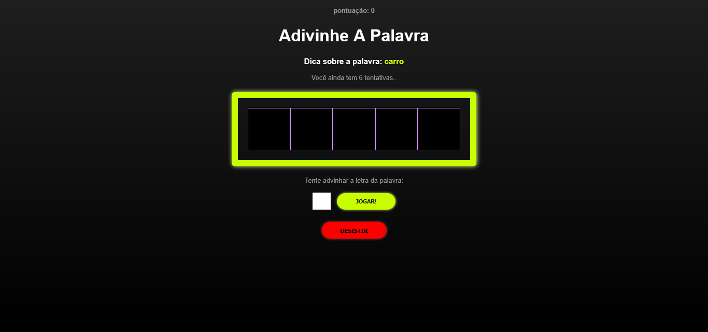
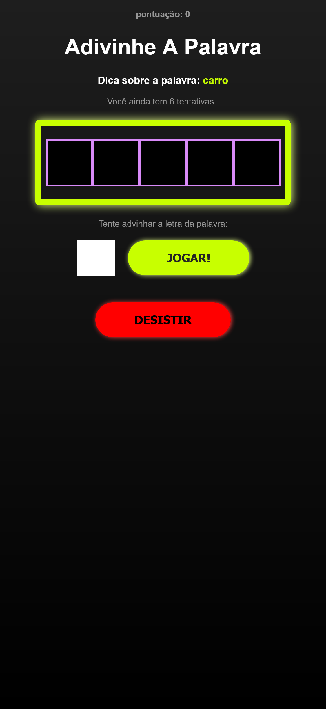

# Jogo SecretWord com React + Vite

Este é meu primeiro projeto em React. Se trata de um Jogo simples no qual o usuario deve advinhar uma palavra sorteada aleatoriamente.

O usuario começa com um total de 6 tentivas (guesses) e deve inserir uma letra por vez até completar a palavra, e assim, seguir para próxima acumulando pontos. A cada letra errada, suas tentivas diminuem, enquanto que a cada palavra completada, sua pontuação aumenta. Quando as tentivas chegam a zero o jogo acaba e é mostrada a pontuação final atingida por ele.

## Conteúdo

- [Overview](#overview)
  - [Screenshot](#screenshot)
  - [Links](#links)
- [Sobre o projeto](#sobre-o-projeto)
  - [Feito com](#feito-com)
  - [O que aprendi](#o-que-aprendi)
  - [Desenvolvimento contínuo](#desenvolvimento-contínuo)
  - [Recursos Extras](#recursos-extras)
- [Autor](#autor)
- [Agradecimentos](#agradecimentos)

## Overview

### Screenshot

- **Desktop | width >= 1366px**



- **Smartphones | width: 375px**



### Links

- Projeto URL: [Repositório GitHub](https://github.com/CaioLopes5556/secretword)
- Live Site: [Deploy do Projeto](https://caiolopes5556.github.io/secretword)

## Sobre o projeto

### Feito com

- Semantic HTML5 markup
- CSS custom properties
- Flexbox
- React + Vite
- Javascript
- Node JS

### O que aprendi

Como primeiro projeto, coloquei em prática conceitos básicos do React e da linguagem JSX.

Utilizei alguns Hooks como: useState, useCallBack e useEffect
(_Para a manipulação das funcionalidades principais do jogo._);

Ex:

```
//states
  const [pickedWord, setPickedWord] = useState('');
  const [pickedCategory, setPickedCategory] = useState('');
  const [letters, setLetters] = useState([]);

//start secret word
  const startGame = useCallback( () => {
    //clean the states
    clearLetterStates();
    const { sortedWord, sortedCategory} = pickWordAndCategory();

    // console.log(sortedWord, sortedCategory);

    //Letters Array
    let wordLettters = sortedWord.split('')

    wordLettters = wordLettters.map((l) => l.toLowerCase())

    //setting the states
    setPickedCategory(sortedCategory);
    setPickedWord(sortedWord);
    setLetters(wordLettters);


    //starts the game
    setGameStage(stages[1].nameStage)
  }, [pickWordAndCategory]);

```

Utilizei props para passar valores entre componentes pais e filhos;

Ex:

```
<div className='App'>
      {gameStage === 'start' && <StartScreen start={startGame} /> }
      {gameStage === 'game' &&
      <Game
        retry={retry}
        verifyLetter={verifyLetter}
        pickedCategory={pickedCategory}
        pickedWord={pickedWord}
        guessedLetters={guessedLetters}
        wrongLetters={wrongLetters}
        letters={letters}
        guesses={guesses}
        score={score}
      /> }
      {gameStage === 'end' && <GameOver retry={retry} score={score} /> }
</div>

```

Utilizei a técnica de Conditional Render (renderização condicional) para alguns elementos;

Ex:

```Game.jsx

{/* Apenas aparece se o usuario errar alguma letra  */}

{
      wrongLetters.length !== 0 &&
      <div className="wrongLettersContainer">
        <p>Letras erradas:</p>
        {

          wrongLetters.map((letter,i)=>(
              <span key={i}>{letter}</span>
          ))
        }
      </div>
    }

```

Manipulação do CSS com alguns estilos padrões para todos os componentes (index.css), e outros individuais;

Utilizei Arrow Function em boa parte das funções;

Coloquei imagens no projeto pela pasta Public;

### Desenvolvimento Contínuo

Apesar ter um conhecimento básico em Javascript, consegui entender e criar todo o processo e a lógica deste projeto. Senti o quanto a junção de HTML e JS em só lugar facilita o desenvolvimento de sistemas e sua futura manutenção (componentizar é vida).

Gostei bastante de colocar em pratica esses conhecimentos recém-obtidos e me sinto animado para continuar essa trilha de aprendizados em React.

No caso deste projeto, foi utilizado um Array com o status do jogo para fazer as mudanças de componentes.
Em breve irei estudar mais sobre Routes e Requisições HTTP para realizar essas mudanças na SPA.

### Recursos Extras

- [Legacy](https://legacy.reactjs.org/docs/hooks-state.html) - Utilizei esse site para tirar dúvidas de alguns Hooks como useState e useEffect e solidificar conhecimentos sobre eles.

## Autor

- Frontend Mentor - [@CaioLopes5556](https://www.frontendmentor.io/profile/CaioLopes5556)
- Linkedin - [@caio-silva-42848a236](https://www.linkedin.com/in/caio-silva-42848a236)

## Agradecimentos

Gostaria de agradecer ao Matheus Battisti do canal "Hora de Codar" pelo conteúdo e excelente didatica que tornaram esse projeto possível.
